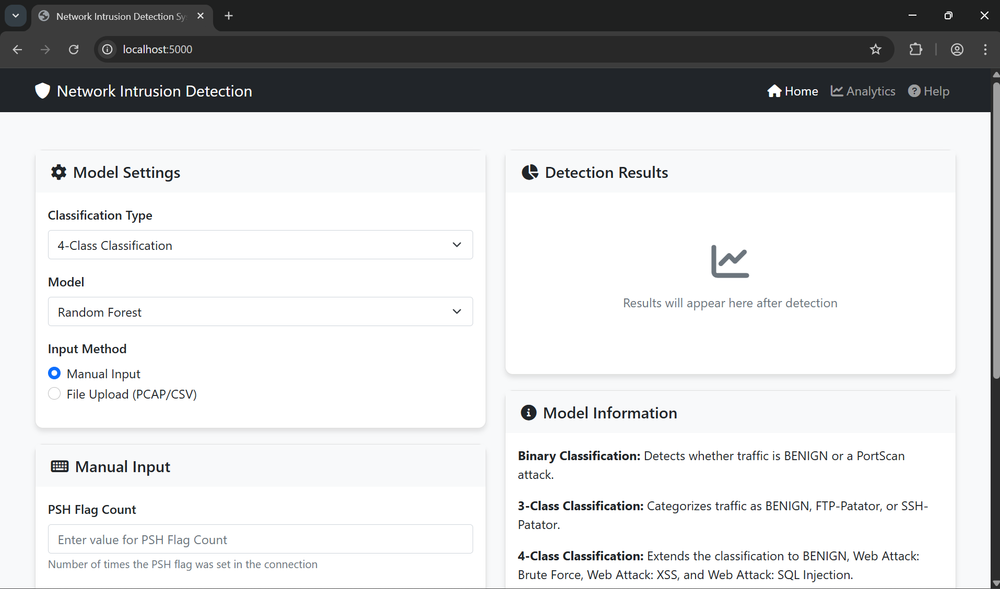
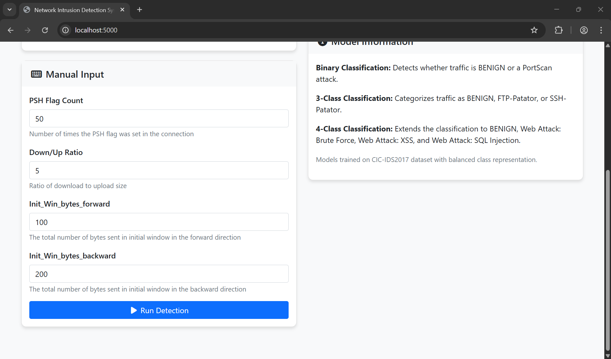
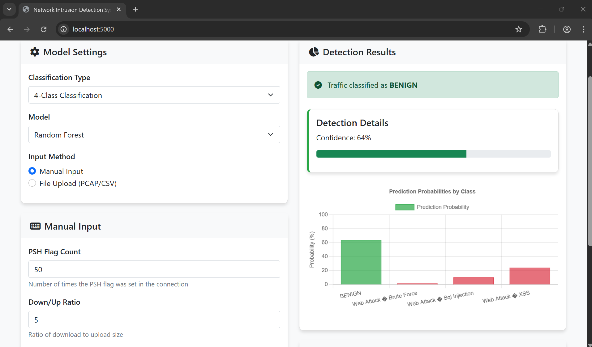

# Network Intrusion Detection System

A machine learning-based platform for detecting and classifying network intrusions using real-world traffic data.


## Features

- **Multi-model classification system** with binary and multi-class intrusion detection
- **Flask REST API backend** with prediction, model information, and data upload endpoints
- **Interactive web UI** with real-time visualization of detection results
- **Comprehensive ML pipeline** with feature scaling, PCA, and ensemble models
- **Docker support** for easy deployment and scaling

## Screenshots

Here are some screenshots of the application:

*Main interface with model settings and classification options*


*Manual input of network traffic features for analysis*


*Detection results showing classification and probability distribution*


## Tech Stack

### Backend
<p align="left">
  
  
  
  
  
  
</p>

### Frontend
<p align="left">
  
  
  
  
  
</p>

### Machine Learning
<p align="left">
  
  
  
  
  
</p>

## Project Structure

```
network-intrusion-detection-system/
├── api/                          # Backend Flask application
│   ├── app.py                    # Main Flask app with REST endpoints
├── models/                       # ML model storage
│   ├── binary/                   # Binary classification models
│   ├── multiclass_3/             # 3-class models
│   └── multiclass_4/             # 4-class models
├── data/                         # Data storage
│   ├── raw/                      # Raw network traffic datasets
│   └── preprocessed/             # Processed features and model components
├── src/                          # Source code
│   ├── preprocessing/            # Data preprocessing module
│   │   └── data_preprocessor.py  # Feature engineering and data cleaning
│   └── training/                 # Model training scripts
│       └── models.py             # Training pipeline implementation
├── ui/                           # Frontend application
│   ├── index.html                # Main web interface
├── notebooks/                    # Jupyter notebooks for analysis
├── main.py                       # Application entry point
├── Dockerfile                    # Container configuration
├── requirements.txt              # Python dependencies
└── LICENSE                       # MIT License
```

## Installation & Setup

### Option 1: Local Installation

```bash
# Clone the repository
git clone https://github.com/venkapk/network-intrusion-detection-system.git
cd network-intrusion-detection-system

# Create and activate virtual environment
python -m venv venv
source venv/bin/activate  # On Windows: venv\Scripts\activate

# Install required packages
pip install -r requirements.txt

# Start the application
python main.py --host 127.0.0.1 --port 5000
```

### Option 2: Docker Deployment

```bash
# Build the Docker image
docker build -t nids:latest .

# Run the container
docker run -p 5000:5000 nids:latest
```

## Usage

1. Access the web interface at http://localhost:5000
2. Choose a classification type (Binary, 3-Class, or 4-Class)
3. Select model type (Random Forest or XGBoost)
4. Input network traffic features or upload a PCAP/CSV file
5. View detection results with confidence scores and probability distribution

## API Endpoints

| Endpoint | Method | Description |
|----------|--------|-------------|
| `/api/predict` | POST | Make predictions using trained models |
| `/api/models` | GET | Get information about available models |
| `/api/features` | GET | Get feature information for a model type |
| `/api/upload` | POST | Upload network traffic data for analysis |

## Model Performance

### Binary Classification (Attack vs. Benign)
- **Accuracy**: 97%-100%
- **Precision**: XGBoost & Random Forest achieved perfect 1.00 precision for both classes
- **Recall**: XGBoost & Random Forest achieved perfect 1.00 recall for both classes
- **F1-Score**: 0.96-1.00
- **Best Model**: Random Forest and XGBoost (tied at 100% accuracy)

### 3-Class Classification
- **Accuracy**: 98% (XGBoost, Random Forest)
- **Weighted Avg Precision**: 0.99
- **Weighted Avg Recall**: 0.98
- **Weighted Avg F1-Score**: 0.98
- **Class Performance**: Strong for majority class (0), moderate for class 1 (F1: 0.81), poor for rare class 2 (F1: 0.08)
- **Best Model**: Random Forest and XGBoost (tied at 98% accuracy)

### 4-Class Classification
- **Accuracy**: 99-100% (Random Forest)
- **Weighted Avg Precision**: 1.00 (Random Forest)
- **Weighted Avg Recall**: 0.99-1.00
- **Weighted Avg F1-Score**: 0.99-1.00
- **Class Performance**: Excellent for majority class (0), moderate for rare classes (1, 2, 3)
- **Best Model**: Random Forest (100% weighted average F1-score)

> **Note on Class Imbalance**: While overall accuracy is very high for all models, performance on minority classes varies. Random Forest consistently performs best across all classification tasks, especially with imbalanced data.

## Key Features For Detection

Feature importance analysis identified these critical network traffic indicators across different classification tasks:

### Binary Classification (Most Important)
- **Destination Port**: Target port of the connection
- **Total Length of Fwd Packets**: Total size of packets in forward direction
- **Bwd Packet Length**: Maximum and minimum packet sizes in backward direction
- **Bwd IAT Statistics**: Total, mean, and standard deviation of inter-arrival times
- **PSH Flag Count**: Number of TCP packets with PSH flag set

### 3-Class Classification (Most Important)
- **Min Packet Length**: Smallest packet size in the connection
- **PSH Flag Count**: Number of TCP packets with PSH flag set
- **Init_Win_bytes_forward**: Initial TCP window size in forward direction
- **act_data_pkt_fwd**: Number of packets with at least 1 byte of TCP data payload

### 4-Class Classification (Most Important)
- **PSH Flag Count**: Number of TCP packets with PSH flag set
- **Down/Up Ratio**: Ratio between download and upload traffic volume
- **Init_Win_bytes_forward/backward**: TCP initial window size in both directions

### Common Indicators Across All Classification Types
- **PSH Flag Count**: Consistently important across all attack types
- **Initial Window Size**: Important for both 3-class and 4-class attacks
- **Traffic Direction Metrics**: Down/Up ratio and directional packet characteristics

## Challenges & Solutions

- **Imbalanced Dataset**: Implemented specialized handling for highly skewed class distributions
- **Feature Selection**: Identified optimal feature subsets for different intrusion types
- **Real-time Analysis**: Optimized inference pipeline for rapid processing
- **Model Interpretability**: Added feature importance visualization for explainability

## Future Improvements

- [ ] Add support for real-time network traffic monitoring
- [ ] Implement anomaly detection for zero-day attack identification
- [ ] Develop more sophisticated visualization options
- [ ] Integrate with SIEM systems for enterprise security

## License

This project is licensed under the MIT License - see the [LICENSE](LICENSE) file for details.

## Acknowledgments

- Network Intrusion Detection Dataset providers
- Flask and React communities for excellent documentation
- scikit-learn and XGBoost contributors
